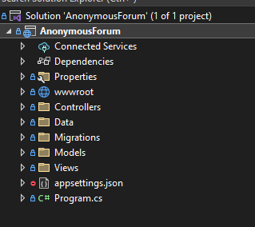
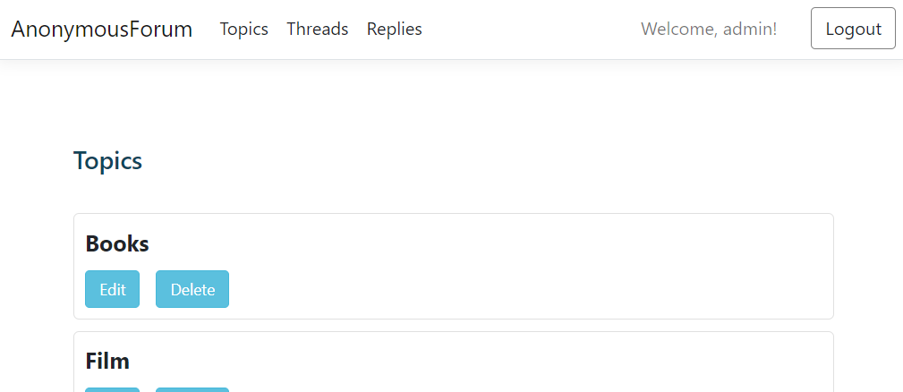
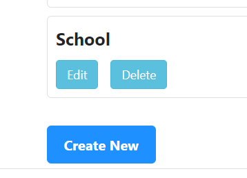


<h1 align="center">MVC Anonymous Forum 🗣️</h1>

<p align = center>
by <a href="https://github.com/Cecilia-Coutinho">Cecilia Coutinho</a>
</p>

## 🌍 Overview

The development of this project was required by Chas Academy, and as such, it followed the specified requirements and deadline. 

The MVC Anonymous Forum is a web application designed to facilitate discussions on various topics. It follows a Model-View-Controller (MVC) architecture, ensuring separation of concerns for maintainability and scalability. This document provides an overview of the project, lists its features, and explains key design decisions.

## 🚀 Features

✅ **ER Model (Data Schema):** The Entity-Relationship (ER) model to define the database structure.

✅ **Classes Attributes:** Attributes for each entity.

✅ **Validation Input:** Input validation to ensure data integrity.

✅ **SeedData Class:** Class to populate the database with initial data.

✅ **Database Migration and Updates:** Database migration and update procedures.

✅ **Controllers:** to manage the flow of data and interaction between the model and views.

✅ **Basic Views:** Basic views to display information related to topics, threads, and replies:

- **HomePageView:** This view displays a list of topics, providing users with an overview of available discussions. By clicking on a topic, the user can follow the flow to:


  - **TopicThreads PageView:** This view displays a list of threads associated with a selected topic, allowing users to explore specific discussions.

 - Users can create new threads related to a selected topic, promoting user-generated content and interaction.

- **ThreadPageView (Display and Reply):** This view displays a specific thread with a list of replies. Users can also create new replies to participate in the discussion.

✅ **Navigation:** Navigation features to allow users to move between different sections.

✅ **Admin Panel (Optional):** to enhance administrative control over the forum.

## 💻 Technology Stack

* ASP.NET MVC

* C#

* SQL Server Management Studio (SSMS)

* HTML

* CSS

* JavaScript

* Visual Studio

* GitHub


## 📋 Additional Information

### SQL Design

The SQL design follows a relational database model, with tables representing entities such as topics, threads, and replies. Relationships are established using foreign keys to maintain data integrity. Note: I chose not hardcode Topics as required and instead they are also stored in the database.


### Code Structure

The codebase is organized according to the MVC architecture. Each entity has its corresponding model, view, and controller classes, ensuring a clear separation of concerns. 




Additionally, input validation logic is integrated into the controllers to ensure data integrity.

```
        [Required(ErrorMessage = "Invalid name or Format")]
        [StringLength(30, MinimumLength = 3), DisplayName("Topics"), RegularExpression(@"^[A-Z]+[a-zA-Z\s]*$")]
        public string? TopicName { get; set; }
```

### UseSession vs. UseAuthentication

An admin page was added to allow users with the ability to manage topics, threads and replies. 



I opted for the UseSession approach instead of UseAuthentication. This choice was driven by my interest in exploring a more lightweight method to know how it works. 

```
builder.Services.AddSession(options =>
{
    options.IdleTimeout = TimeSpan.FromMinutes(5);
    options.Cookie.HttpOnly = true;
    options.Cookie.IsEssential = true;
});

...

app.UseSession();

```

```
if (isValidUser)
{
    HttpContext.Session.SetString("IsAuthenticated", "true");
    HttpContext.Session.SetString("Username", username);
    return RedirectToAction("Index", "Topics");
}
```
#### Avoiding Hardcoding Data

By storing topics in the database, we enable dynamic content management. This approach allows for the addition, modification, and deletion of topics without the need to alter the codebase, providing flexibility and scalability.



The user data was not stored in the database, since it was only for exploring purposes, instead I used the Helper Class.


### Conclusion

The MVC Anonymous Forum is a simple but well-structured web application designed to facilitate discussions on various topics. By following MVC principles and making key design decisions, the project provides a good foundation for further development and customization.

